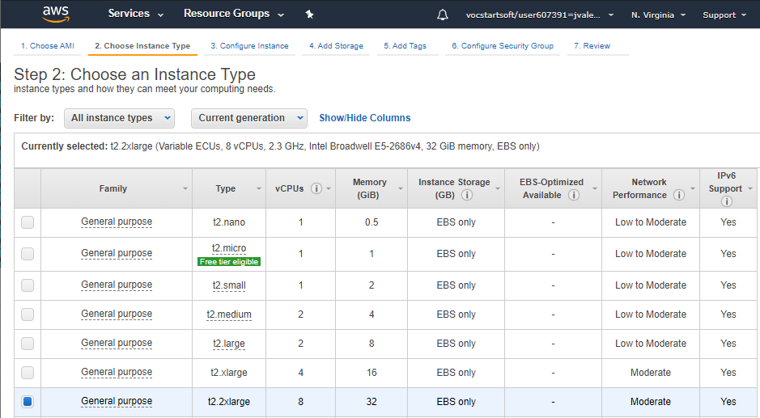
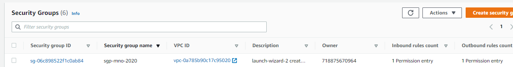
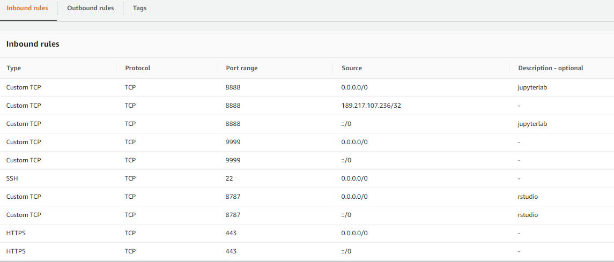
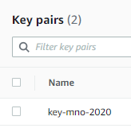
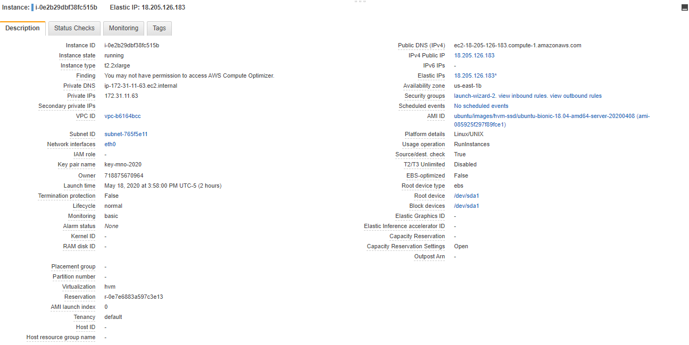
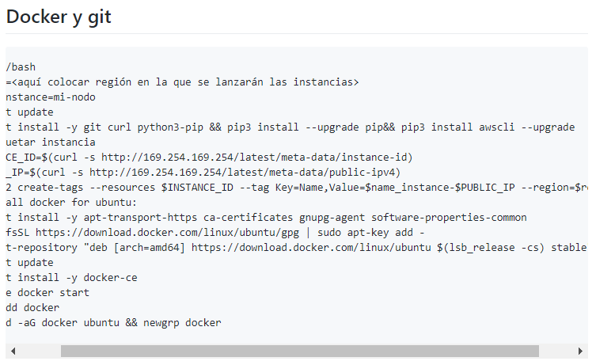
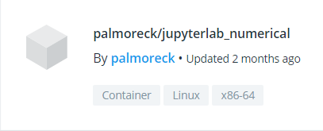
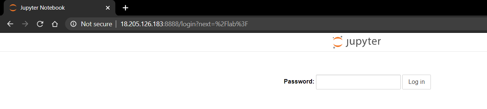
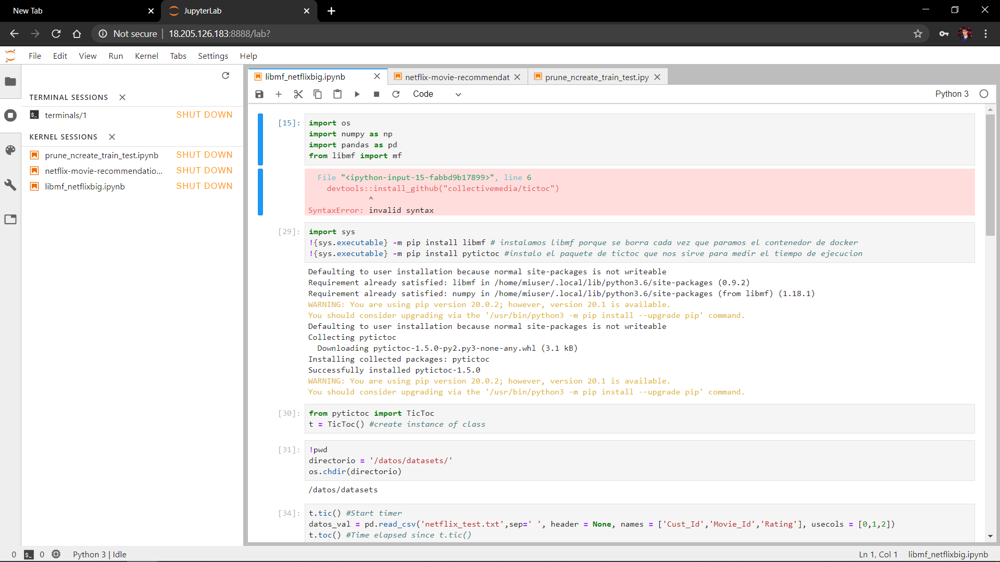

## Proyecto Final del curso MNO-2020-1: Equipo 5 y 9

Este es el repositorio de Proyecto Final para la materia de Métodos Numéricos y Optimización del semestre 2020-1 en la Maestría en Ciencia de Datos, ITAM.

Título del proyecto: `Uso de LIBMF (A LIBrary for large-scale sparse Matrix Factorization) para sistemas de recomendación de películas con una base de datos de usuarios de Netflix`

Objetivo del proyecto: `**Investigación sobre el uso y explotación de la librería LIBMF empleando el lenguaje de programación Python**. El enfoque del proyecto se orienta al estudio de los parámetros y el uso de paralelización en los métodos disponibles para el caso práctico de realizar recomendaciones de películas a usuarios de Netflix a través de métodos basados en reducción de dimensionalidad o modelos de factores latentes, así como su comparación y evaluación de resultados a través de una muestra de prueba y entrenamiento.`

Trabajo escrito (fuera del repo): https://www.overleaf.com/read/ffbjdrrxtmdm

Presentación de Resultados (en el repo): [liga_presentación](https://github.com/DorelyMS/proyecto-final-equipo5-mno-2020-1/tree/master/Resultados)

Implementación (en el repo): [Implementación](https://github.com/DorelyMS/proyecto-final-equipo5-mno-2020-1/tree/master/Implementation) 

## Indice del proyecto

1. [Introducción](https://github.com/DorelyMS/proyecto-final-equipo5-mno-2020-1/blob/master/README.md#introducci%C3%B3n)
2. [Planteamiento del Problema](https://github.com/DorelyMS/proyecto-final-equipo5-mno-2020-1/blob/master/README.md#planteamiento-del-problema-de-sistemas-de-recomendaci%C3%B3n)
3. [Estructura del equipo](https://github.com/DorelyMS/proyecto-final-equipo5-mno-2020-1/blob/master/README.md#estructura-del-equipo)
4. [Organización del Repositorio](https://github.com/DorelyMS/proyecto-final-equipo5-mno-2020-1/blob/master/README.md#organizaci%C3%B3n-del-repositorio)
5. [Requerimientos de infraestructura](https://github.com/DorelyMS/proyecto-final-equipo5-mno-2020-1/blob/master/README.md#requerimientos-de-infraestructura)

## Introducción 

### Sistemas de Recomendación y LIBMF

Los sistemas de recomendación (*recommender systems*) son un conjunto de métodos que sirven como herramienta para predecir la respuesta de personas a estímulos a los que no han sido expuestos, basados en respuesta a otros estímulos de esta y quizá otras personas similares a su perfil. Por ejemplo, si consideramos usuarios de plataformas de ***streaming***: ¿qué tanto le puede gustar al usuario **** la película ****? Usuarios de sitios de ***e-commerce***: Si se les ofrece el artículo ****, ¿qué tan probable es que lo compren? Anteriormente, las recomendaciones de este tipo de plataformas se basaban únicamente en los raitings populares y se asumía que éstos podrían servir para recomendar a cualquiera (sistemas basados en popularidad). 

Los principales enfoques para ofrecer soluciones a los sistemas de recomendación son:  

+ Aquellos principalmente basados en contenido: En función de características de los estímulos, canciones o películas (por ejemplo, género, actores, país de origen, año, etc.) intentamos predecir el gusto por el estímulo. En este caso, se construyen variables derivadas del contenido de los artículos (por ejemplo: qué actores salen, año, etc. o en textos palabras que aparecen), e intentamos predecir el gusto a partir de esas características. Ejemplo: Si me gustó *Toy Story* entonces el sistema recomienda otras infantiles+animadas como *Monsters Inc*.
+ El enfoque colaborativo busca además “perfilar al usuario” para hacer recomendaciones, tomando como referencia a otros con características similares. Ejemplo: Si a un usuario le gustó *Piratas del Caribe y Alicia en el país de las maravillas*, vemos que a varios otros usuarios a los que también les gustaron otras películas de Johnny Depp, recomendamos “*Charlie y la fábrica de chocolate*”.


Por otra parte, este tipo de sistemas se clasifican en dos tipos basados en la recolección de datos: El explícito, donde el usuario brinda la calificación directamente y el implícito en el que se deriva de la actividad de los usuarios. 

A través de *machine learning*, apoyándose de métodos numéricos para encontrar soluciones a problemas de minimización no convexos, los sistemas de recomendación bajo enfoque colaborativo y datos explícitos han logrado tener una mejora notable en las recomendaciones. Esto se debe al uso de métodos basados en reducción de dimensionalidad o modelos de factores latentes: los cuales se basan en encontrar **** factores latentes (no observados) que describan películas con “contenido implícito similar”, y usuarios según su interés en esa dimensión.  

El presente proyecto utiliza el enfoque colaborativo en sistemas de recomendación de películas para el estudio, dominio y explotación de la librería **LIBMF** (*A LIBrary for large-scale sparse Matrix Factorization*), usando el método de descenso en gradiente para la predicción de calificaciones que dará un usuario a las películas en una muestra de validación a partir de la factorización de la matriz de entrenamiento *R* con las calificaciones observadas por *m* usuarios y **** películas en términos de 2 matrices  y . En específico, el producto a evaluar a través de sistemas de recomendación son películas con ratings explícitos y se usará una base de datos de *Netflix* para sugerir ver aquella película con calificación más alta.

LIBMF provee un método eficiente de programación en paralelo para encontrar la factorización de matrices de diferentes tipos. Su uso está disponible en C/C++, R, Python y puede ser compilado en Unix, Cygwin, Windows o en MacOS. Las pruebas en este caso se realizarán en Pyhton a través de la imagen de Docker usada en el curso de MNO 2020 (palmoreck/jupyterlab\_numerical:1.1.0) y se utilizará una instancia EC2 en AWS para poder realizar cómputo en la nube para poder trabajar con la muestra de datos de dimensiones **.

Para problemas en general, la factorización de matrices busca descomponer una matriz *R* de dimensiones **** en dos matrices:  y . La importancia de la descomposición de matrices se debe a que se busca aprender de la matriz *R* de tal forma en la que el producto de matrices  consiga reducir la dimensionalidad de los datos y hacer más eficiente la predicción de nuevos datos. En este tipo de representación, las entradas de las matrices  indican para nuestro problema práctico la calificación que el usuario **** le dio a la película ****. El uso de la representación de este problema a través de matrices, con lleva al uso de dimensiones grandes, además de que éstas puedan ser singulares y suelen tener demasiadas entradas con ceros (ralas). Esto sucede porque prácticamente nadie ve todas las películas.

### Base de Datos *Netflix*

Para probar la librería utilizamos un extracto de la base de datos original que proviene del concurso de *Netflix* o *Netflix Price* que se llevó a cabo en 2009 y fue tomada de la clase de Métodos Analíticos del ITAM impartida por el profesor Felipe González. La base completa contiene más de *100* millones de calificaciones de *480,189* usuarios de la plataforma seleccionados aleatoriamente y más de *17,770* títulos de películas. Las calificaciones obtenidas van en una escala del 1 al 5 y las evaluaciones fueron entre Octubre 1998 a Diciembre 2005.

La base extracto con la que realizamos nuestra investigación de la librería contaba con sólo *100,000* usuarios y las *17,770* películas. Las únicas columnas disponibles son el ID de usuario y película, ID de usuario asignado respecto al renglón ****, calificación de la película y fecha con formato YYYY-MM-DD. Para esta base de datos se tiene un total de 20,968,941 entradas ya que no todos los usuarios califican todas las películas. Las entradas de esta base se muestras a continuación:


Finalmente, para la evaluación del desempeño de libmf en la predicción de las calificaciones, se separó el datasetanterior en una muestra de entrenamiento y validación a partir de las columnas peli\_id, y usuario\_id. Seleccionando aleatoriamente el 20\% de los usuarios y películas en validación y el resto en entrenamiento.

## Estructura del equipo

Para el desarrollo del proyecto, la división de los integrantes considera una distribución adaptada a su porcentaje de avance, por lo que de manera inicial, se decidió dividir al equipo en 2 partes: el primero y más grande, encargado de la implementación del uso de libmf para resolver nuestro caso práctico (**Equipo de Programación, o P-Team**) y el segundo, encargado de la documentación, revisión de los reportes de resultados para su presentación y trabajo escrito (**Equipo de Revisión, o R-Team**). Finalmente, ambos grupos fueron coordinados por un project manager (**PM**)

La anterior estructura vigente hasta el 10 de mayo, se resume en la siguiente tabla:

| #    | Rol                                      | Persona      | Github    |
| ---- | ------------------------ | ------------ | --------- |
| 1    | Programación                             |  Alfie       | gonzalezalfie     |
| 2    | Programación                             |  Guillermo   | gzarazua          |
| 3    | Programación                             |  Javier      | valencig          |
| 4    | Programación                             |  Maggie      | maggiemusa        |
| 5    |Investigación, Revisión & documentación   |  Oscar       | oaguilarca        |
| 6    | Project Manager                          | Dorely       | DorelyMS          |

## Organización del Repositorio

La organización del repositorio se realizó a través una serie de carpetas, las cuales se describen a continuación:

+ **Referencias:** En el apartado de [Referencias](https://github.com/DorelyMS/proyecto-final-equipo5-mno-2020-1/tree/master/Referencias) se añaden todos los textos que se consultaron para la realización de este trabajo.
+ **Diseño de Muestra:** En la carpeta [obtención de muestra](https://github.com/DorelyMS/proyecto-final-equipo5-mno-2020-1/tree/master/Sampling_Design) se desarrolló el código para la obtención de las muestras de entrenamiento y validación para la base de datos de Netflix que se usará para el reporte de resultados.
+ **Implementación:** [Reportes de implementación](https://github.com/DorelyMS/proyecto-final-equipo5-mno-2020-1/tree/master/Implementation) del uso de libmf para pruebas con diferentes muestras y parámetros. 
+ **Avances:** Contiene un resumen de los [avances de proyecto final](https://github.com/DorelyMS/proyecto-final-equipo5-mno-2020-1/tree/master/Avances) detallado por **PM** y complementado por **P&R Teams** para efecto de reportar al profesor los avances en el desarrollo del proyecto, así como las nuevas tareas a realizar.
+ **Resultados**: Incluirá el [Reporte ejecutivo de resultados](https://github.com/DorelyMS/proyecto-final-equipo5-mno-2020-1/tree/master/Resultados) obtenido con la implementación del resultado final sobre nuestra base final depurada para nuestro caso práctico generado a partir de una instancia de AWS aplicando paralelización con una imagen de Docker.

## Requerimientos de infraestructura
A continuación, se describen los pasos utilizados para la creación de la instancia en AWS para poder trabajar de manera más rápida y eficiente.
### Crear la maquina EC2
Se utilizó una cuenta de AWS Educate lo cual limitó un poco la opciones a elegir de máquinas EC2.
**Paso 1**: Se lanzó una instancia de AWS de tipo EC2, la Amazon Machine Image (AMI) que se eligió fue una del tipo  **ubuntu/images/hvm-ssd/ubuntu-bionic-18.04-amd64-server-20200408**

**Paso 2**: El tipo de instancia que se eligió fue una t2.2xlarge que cuenta con 8 VCPUs y tiene 32 GB de memoria RAM y 32GB de memoria en disco duro, originalmente habíamos elegido usar una máquina de tipo p2.xlarge que cuenta con GPUs disponibles pero debido a las restricciones de la cuenta AWS Educate no fue posible.

**Paso 3**: Se configuró la instancia siguiendo los pasos de la wiki  de AWS del curso de MNO situados en esta liga web https://github.com/ITAM-DS/analisis-numerico-computo-cientifico/wiki/1.1.Configuracion-de-servicios-basicos-para-uso-de-AWS
En resumen, se tuvo que configurar una VPC, una subnet pública, un grupo de seguridad, una IP elástica para no tener que cambiar el comando de conexión cada vez que quisiéramos conectarnos a la EC2.
**Grupo de seguridad**
Se hicieron algunas modificaciones al grupo de seguridad estándar para permitir que todos los miembros del equipo se pudieran conectar de manera fácil al servidor de la EC2



**Paso 4**: Se creó un key-pair llamado "key-mno-2020.pem"


El resultado final fue esta EC2


### Instalación de herramientas de trabajo en la EC2

Inicialmente se instaló Anaconda en la EC2 pero al final se decidió trabajar con un contenedor de Docker que contiene todos los requerimientos necesarios para ejecutar el código del proyecto.
Se corrió un bash script que estaba en la wiki de AWS del repositorio de MNO para instalar git y docker 

Se descargó y utilizó la imagen de docker jupyter_numerical para correr nuestro proyecto.

El comando usado para correr la imagen fue el siguiente
Correr docker imagen jupyter_numerical
```bash
sudo docker run --rm -v /home/ubuntu:/datos --name jupyterlab_numerical -p 8888:8888 -d palmoreck/jupyterlab_numerical:1.1.0 --ip=0.0.0.0 --no-browser
```
### Conexión a la EC2 y al servidor de Jupyter Lab

Para conectarse a la EC2 se usó el siguiente comando en la dirección donde estaba la llave.pem :
```bash
ssh -i key-mno-2020.pem ubuntu@18.205.126.183
```
También al inicio del proyecto antes de configurar correctamente el security group fue necesario usar un comando para hacer portforwarding de la EC2 a nuestra computadora y así visualizar el puerto con el Jupyter Notebook:
```bash
ssh -i "key-mno-2020.pem" -NL localhost:5555:localhost:8888 ubuntu@18.205.126.183
```

Finalmente una vez configurado el security group fue posible conectarse al servidor de Jupyter Lab usando una dirección IP e introduciendo el password: querty
http://18.205.126.183:8888/



Con el propósito de reproducibilidad del proyecto y para que todos los equipos (**P-Team**, **R-Team** y **PM**) tuvieran un entorno común de trabajo, se empleó la imagen de docker basada en Python del curso MNO 2020 (palmoreck/jupyterlab_numerical:1.1.0) así como una instancia de AWS con las siguientes características:

```bash
docker run --rm -v <ruta a mi directorio>:/datos --name jupyterlab_numerical
-p 8888:8888 -d palmoreck/jupyterlab_numerical:1.1.0
```
Documentación de la imagen de docker palmoreck/jupyterlab_numerical:1.1.0 en [liga](https://github.com/palmoreck/dockerfiles/tree/master/jupyterlab/numerical)

```
Infraestructura: AWS (ESTE SOLO ES UN EJEMPLO)

+ AMI: ami-0915e09cc7ceee3ab, Amazon Linux AMI 2018.03.0 (HVM)
+ EC2 instance:
  + GPU: 1
  + vCPU: 1
  + RAM: 1 GB
+ OS: Linux AMI 2018.03.0
+ Volumes: 1
  + Type: gp2
  + Size: 16 GB
+ RDS: PostgreSQL
  + Engine: PostgreSQL
  + Engine version: 10.6
  + Instance: db.t2.micro
  + vCPU: 1
  + RAM: 1 GB
  + Storage: 80 GB
```
Con ello se habilitó la posibilidad de realizar el trabajo mediante sucesivos *Jupyter Notebooks*.
